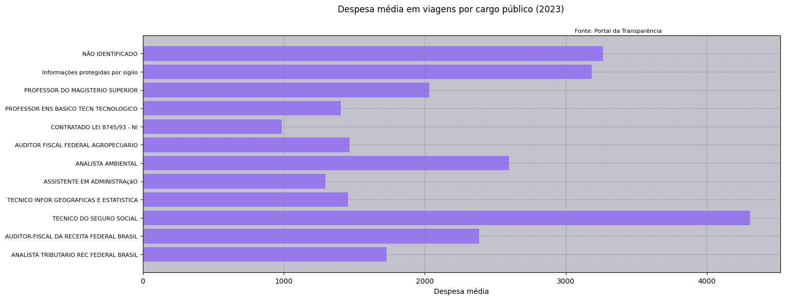

# Análise de Viagens a Serviço - Governo Federal (2023)

Análise das despesas com viagens a serviço do Governo Federal em 2023, agrupadas por cargo público. O notebook gera:

- uma **tabela consolidada** por cargo (despesa média, duração média, despesas totais, destino mais frequente e número de viagens), salva em Excel;
- um **gráfico** da despesa média por cargo, considerando apenas os cargos com mais de 1% das viagens.



> As barras estão ordenadas pelo **número de viagens** de cada cargo (de cima para baixo, do mais ao menos frequente), e não pelo valor da despesa média.

## Principais resultados

Valores aproximados, lidos do gráfico acima.

- **Técnico do Seguro Social tem a maior despesa média por viagem**, em torno de R$ 4.300. É mais que o dobro da de cargos como Professor do Magistério Superior (cerca de R$ 2.000).
- **A despesa média varia bastante entre cargos**: de cerca de R$ 1.000 (Contratado Lei 8745/93) a mais de R$ 4.000.
- **Os dois grupos com mais viagens não são cargos de fato**: "Não identificado" e "Informações protegidas por sigilo". Ambos têm despesa média alta, perto de R$ 3.200. Isso mostra uma limitação dos dados: uma parte relevante das viagens não permite saber quem viajou.
- **Entre os cargos identificados**, Analista Ambiental (cerca de R$ 2.600) e Auditor-Fiscal da Receita Federal (cerca de R$ 2.400) aparecem logo depois dos primeiros colocados.

**Limitações:** a média por cargo pode ser puxada para cima por poucas viagens muito caras, como as internacionais. A análise não separa viagens nacionais e internacionais nem considera o motivo da viagem.

## Fonte dos dados

[Portal da Transparência do Governo Federal](https://portaldatransparencia.gov.br/) (Controladoria-Geral da União), seção **Download de dados > Viagens**. São dados públicos.

O arquivo bruto **não está neste repositório** por ser grande demais para o GitHub.

## Como executar

1. Clone o repositório e instale as dependências:
   ```bash
   pip install -r requirements.txt
   ```
2. Baixe os dados de viagens de **2023** no Portal da Transparência, extraia o `.zip` e coloque o arquivo `2023_Viagem.csv` dentro da pasta `data/`.
3. Abra e execute o notebook:
   ```bash
   jupyter notebook analise_viagens.ipynb
   ```
4. Os resultados são salvos na pasta `output/` (`tabela_2023.xlsx` e `grafico_2023.png`).

## Estrutura

```
.
├── analise_viagens.ipynb
├── requirements.txt
├── images/      # gráfico exibido neste README
├── data/        # coloque aqui o 2023_Viagem.csv (ignorado pelo Git)
└── output/      # tabela e gráfico gerados (ignorado pelo Git)
```

## Observações

- O CSV usa codificação `Windows-1252`, separador `;` e vírgula como separador decimal.
