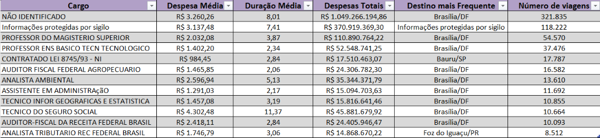

# Análise de Viagens a Serviço - Governo Federal (2023)

[](https://colab.research.google.com/github/amandapereez/analise-viagens/blob/main/analise_viagens.ipynb)

Análise das despesas com viagens a serviço do Governo Federal em 2023, agrupadas por cargo público. O notebook gera:

- uma **tabela consolidada** por cargo (despesa média, duração média, despesas totais, destino mais frequente e número de viagens), salva em Excel;
- um **gráfico** da despesa média por cargo, considerando apenas os cargos com mais de 1% das viagens.


> As barras estão ordenadas pelo **número de viagens** de cada cargo (de cima para baixo, do mais ao menos frequente), e não pelo valor da despesa média.

## Tabela consolidada por cargo



A tabela em Excel está em [`output/tabela_2023.xlsx`](output/tabela_2023.xlsx).

## Principais resultados

- **Técnico do Seguro Social tem a maior despesa média por viagem**: R$ 4.302,48, mais que o dobro da de Professor do Magistério Superior (R$ 2.032,08). Também é o cargo com a maior duração média de viagem, 11,37 dias, o que provavelmente ajuda a explicar o valor.
- **A despesa média varia bastante entre cargos**: de R$ 984,45 (Contratado Lei 8745/93) a mais de R$ 4.000.
- **Os dois grupos com mais viagens não são cargos de fato**: "Não identificado" e "Informações protegidas por sigilo". Juntos, respondem por cerca de 70% das viagens e 80% da despesa total entre os cargos da tabela, com despesa média de R$ 3.260,26 e R$ 3.137,48. Isso é uma limitação dos dados: grande parte das viagens não permite saber quem viajou.
- **Entre os cargos identificados**, depois do Técnico do Seguro Social, os maiores gastos médios são de Analista Ambiental (R$ 2.596,94) e Auditor-Fiscal da Receita Federal (R$ 2.418,11).
- **Brasília/DF é o destino mais frequente** na maior parte dos cargos.

**Limitações:** a média por cargo pode ser puxada para cima por poucas viagens muito caras, como as internacionais. A análise não separa viagens nacionais e internacionais nem considera o motivo da viagem.

## Fonte dos dados

[Portal da Transparência do Governo Federal](https://portaldatransparencia.gov.br/) (Controladoria-Geral da União). São dados públicos.

O arquivo `2023_Viagem.csv` é grande demais para o GitHub, então o notebook o baixa automaticamente de uma cópia no [Google Drive](https://drive.google.com/file/d/18j80hFqWkKMRyWGm_Jol539dX0Z0Vkoz/view).

## Como executar

**No Google Colab (1 clique):** clique no botão "Abrir no Colab" no topo desta página e execute as células. Os dados são baixados sozinhos.

**No seu computador:**
1. Instale as dependências: `pip install -r requirements.txt`
2. Execute o notebook `analise_viagens.ipynb`. Na primeira vez, ele baixa o CSV para a pasta `data/`.

Os resultados são salvos na pasta `output/`.

## Estrutura

```
.
├── analise_viagens.ipynb
├── requirements.txt
└── output/
    ├── grafico_2023.png
    ├── tabela_2023.png
    └── tabela_2023.xlsx
```

## Observações

- O CSV usa codificação `Windows-1252`, separador `;` e vírgula como separador decimal.
